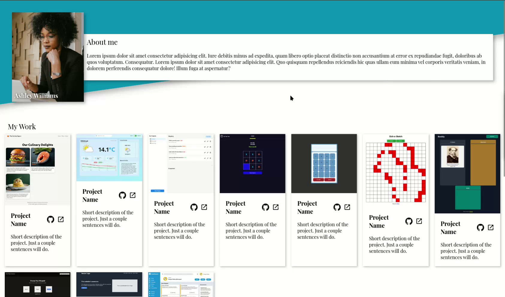
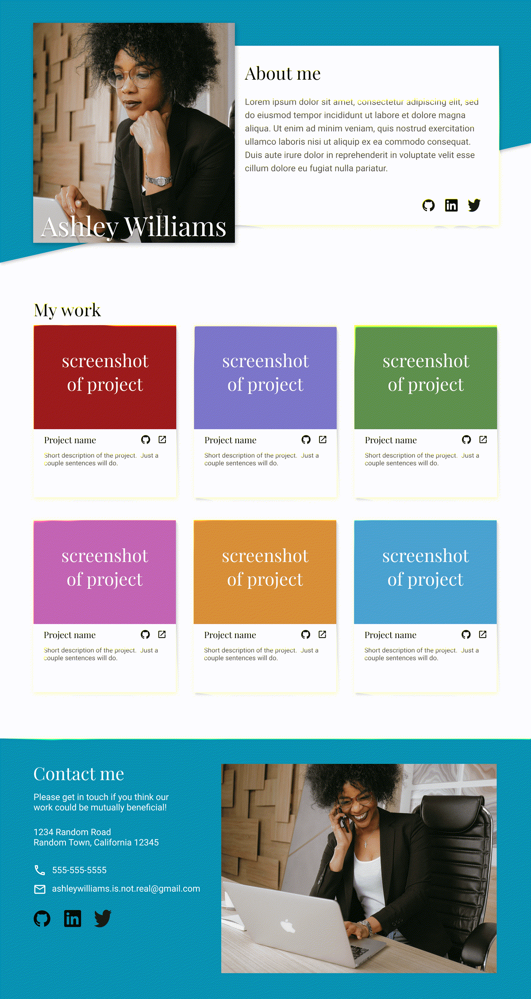
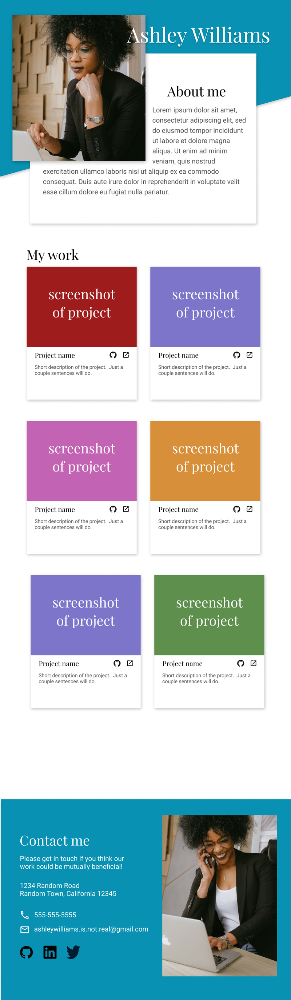
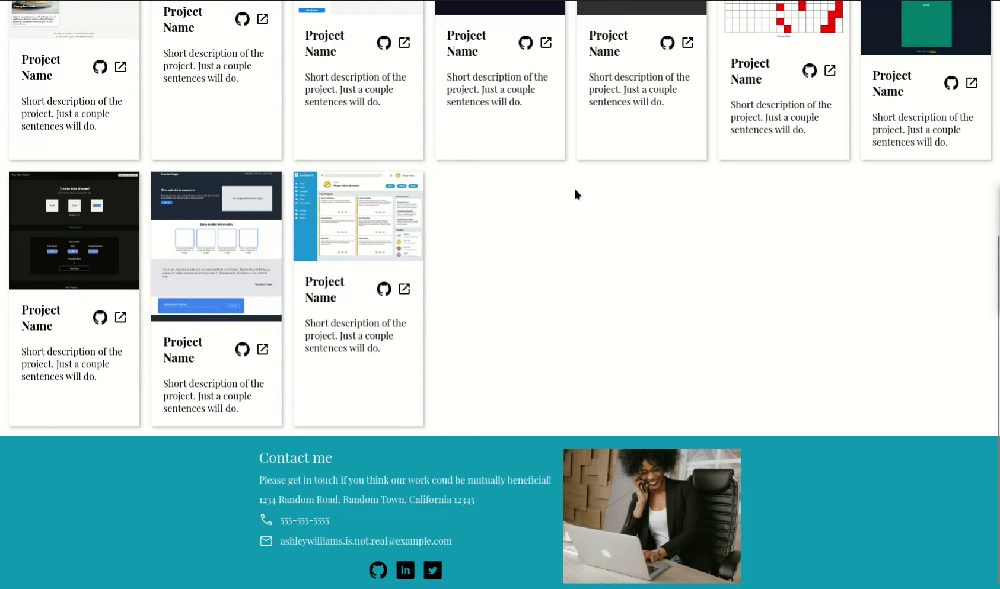
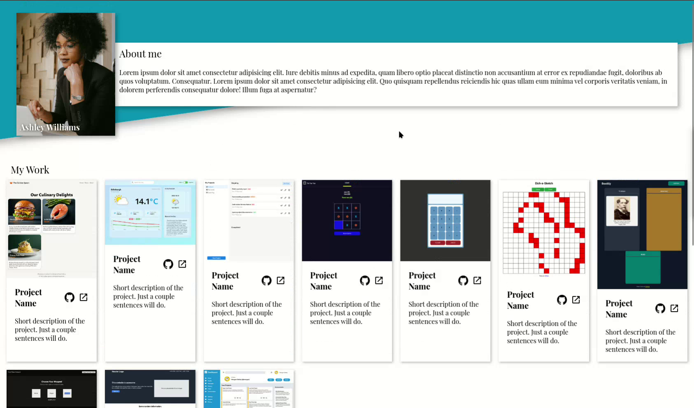
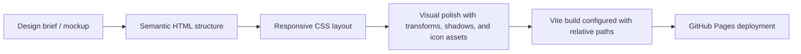

# Odin Homepage

<p align="center">
  Responsive portfolio-style homepage built for The Odin Project's Advanced HTML & CSS curriculum.
</p>

<p align="center">
  <a href="https://smailoujaoura.github.io/odin_homepage/">Live Demo</a>
  ·
  <a href="https://github.com/smailoujaoura/odin_homepage">Source Code</a>
  ·
  <a href="./docs/video.webm">Scroll Demo Video</a>
</p>

<p align="center">
  
</p>

## Overview

This project is a responsive portfolio homepage built as part of The Odin Project. The assignment looks simple on the surface, but it asks for a very practical front-end skill set: translating a static design into semantic HTML, building a flexible layout in CSS, and shipping the final result cleanly to production.

The page presents a fictional portfolio for "Ashley Williams" and is intentionally light on JavaScript. Most of the work happens in layout composition, spacing, layering, responsiveness, and deployment details rather than application logic.

> This project demonstrates the ability to take a visual brief, implement it faithfully across breakpoints, and solve the last-mile issues required to actually deploy it.

## Responsive Preview

<p align="center">
  
  
  
</p>

<p align="center">
  <sub>Desktop, tablet, and mobile layouts from the delivered implementation.</sub>
</p>

## Scroll Demo

GitHub READMEs do not reliably autoplay local video, so the motion demo is linked above and represented here with still frames taken from `docs/video.webm`.

<p align="center">
  
  
  
</p>

## What This Project Demonstrates

- Semantic page structure with clear content sections using `main`, `section`, and `footer`
- Responsive layout thinking across desktop, tablet, and mobile breakpoints
- Strong visual hierarchy using CSS layering, shadows, transforms, and spacing
- Grid-based project presentation using `repeat(auto-fill, minmax(...))`
- Lean implementation with minimal JavaScript and most of the complexity handled in CSS
- Production-minded deployment setup for GitHub Pages through Vite

## Delivery Flow



## Technical Highlights

### 1. Semantic, section-based structure

The page is organized around a small but clear information architecture:

- Intro / hero area
- About card with social links
- Project gallery
- Contact footer

That matters because even small static sites benefit from readable structure. It improves maintainability, makes styling easier to reason about, and builds good habits for accessibility and future expansion.

### 2. Responsive project grid

One of the more useful implementation choices is the card layout:

```css
.projects__projects {
  display: grid;
  grid-template-columns: repeat(auto-fill, minmax(200px, 1fr));
  gap: 20px;
}
```

Instead of hard-coding the number of columns, the layout lets the browser create as many cards per row as space allows. That keeps the gallery fluid across screen sizes and reduces the amount of breakpoint-specific CSS needed.

### 3. CSS-driven visual identity

The hero section uses layering and transforms to create a diagonal background shape, while icons are applied through CSS backgrounds. This keeps the HTML cleaner and shows control over visual composition without depending on a UI framework.

### 4. GitHub Pages-safe build configuration

Deploying a Vite project to a repository subpath can break asset URLs if the base path is not configured correctly. This project addresses that directly:

```js
export default defineConfig({
  root: 'src',
  base: './',
  build: {
    outDir: path.resolve(__dirname, 'dist'),
    emptyOutDir: true,
  },
});
```

That configuration is academically valuable because it shows awareness that shipping code is part of the assignment, not an afterthought.

## Key Files

| File | Purpose |
| --- | --- |
| `src/index.html` | Semantic page structure and content layout |
| `src/styles.css` | Typography, layout system, project grid, hero styling, footer styling, and mobile breakpoint behavior |
| `src/main.js` | Minimal entry point for bundling styles with Vite |
| `vite.config.js` | Build output and relative-path configuration for deployment |

## What I Learned

- How to convert a static mockup into a responsive implementation without hiding behind a framework
- How much polish comes from small CSS decisions like spacing, shadows, overlap, and alignment
- How `auto-fill` and `minmax()` can simplify responsive card layouts
- Why semantic HTML still matters even in visually driven landing pages
- How build tooling and deployment configuration can become part of the real technical challenge

## Challenges and How They Were Solved

| Challenge | Why it mattered | Resolution |
| --- | --- | --- |
| Matching the overlapping hero composition | The design depends on layered depth rather than plain blocks | Used positioned elements, shadows, and a transformed pseudo-element background |
| Keeping the project cards flexible | A rigid card layout would break the gallery across widths | Used CSS Grid with `auto-fill` and `minmax()` to let the layout adapt naturally |
| Making the site work from a GitHub Pages subdirectory | Asset paths often break after deployment | Set `base: './'` in Vite and used a subtree-based deployment script |
| Preserving clarity with very little JavaScript | The page still needed to feel intentional and complete | Pushed as much behavior as possible into HTML/CSS instead of adding unnecessary JS |

## Optimization and Engineering Choices

- Minimal JavaScript keeps the bundle simple and the focus on layout craftsmanship
- Relative asset paths make the build more portable in static hosting environments
- Reusable project-card structure keeps the markup predictable and easy to extend
- CSS background icons reduce repeated inline markup and centralize styling decisions
- `emptyOutDir: true` helps avoid stale production artifacts between builds

## Academic Value

This project is academically strong because it exercises the kind of front-end fundamentals that scale into larger work:

- reading a design and turning it into code
- structuring content semantically before styling it
- reasoning about layout behavior across multiple viewport sizes
- balancing aesthetics with maintainability
- debugging deployment issues instead of stopping at "it works locally"

In other words, it is not just a homepage. It is a compact exercise in implementation accuracy, responsive systems thinking, and shipping discipline.

## Why It Matters for Recruiters

For a recruiter or hiring manager, this project signals a few useful things:

- comfort with core web fundamentals instead of framework-only knowledge
- ability to execute visual work with attention to detail
- awareness of deployment realities, not just local development
- evidence of learning through implementation, iteration, and cleanup

It shows the kind of engineering mindset that is valuable on product teams: take a brief, build it carefully, make it responsive, and get it online.

## If I Continued This Project

- Replace placeholder project names and descriptions with real portfolio content
- Add stronger alt text and more explicit accessibility refinements
- Introduce focus-visible states and hover polish for interactive elements
- Turn the repeated project cards into data-driven content
- Add lightweight animations once the final content set is in place

## Running Locally

```bash
npm install
npm run dev
```

To create a production build:

```bash
npm run build
```

## Final Reflection

This project helped bridge the gap between learning layout techniques in isolation and using them together in a polished deliverable. It reinforced that even a "simple" static page can reveal a lot about design sensitivity, CSS fluency, and attention to production details.
